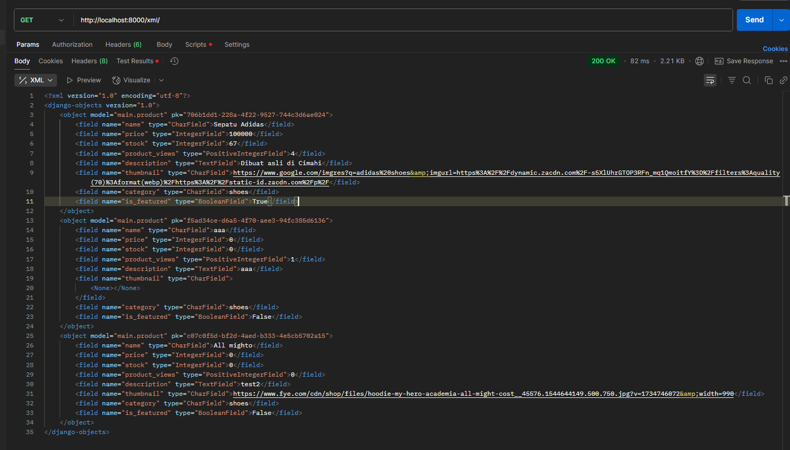
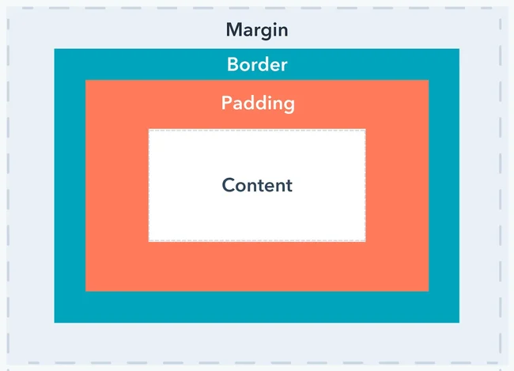

link : https://afero-aqil-allmightystore.pbp.cs.ui.ac.id/    
Nama : Afero Aqil Roihan
NPM  : 2406352304
Kelas: PBP D

#Allmighty Store

##Tugas 2

Cara saya membuat aplikasi main pada django, merouting, dan menghubungan ke PWS:
1. Membuat virtual environment dan mengunduh Dependencies yang diperlukan.
2. Membuat proyek django dengan "django-admin startproject allmighty_store" .
3. Mengonfigurasi dengan membuat file .env , pada settings.py, mengatur isi databases, dan menambahkan allowed hosts.
4. Menambahkan aplikasi main dengan "python manage.py startapp main", dan mendaftarkan aplikasi main pada settings.py. 
5. Pada direktori main, Menambahkan direktori templates, lalu di dalamnya ditambahkan lagi berkas main.html .
6. Pada direktori main, mengisi models yang diperlukan pada models.py.
7. Migrasi model.
8. Menghubungkan views dengan template dengan menggunakan fungsi render pada views.py agar dapat merender tampilan  .
9. Routing URL : Membuat berkas urls.py pada direktori main dan menambahkan url main pada berkas urls.py pada direktori proyek.
10. push ke repository dan PWS.

request client ke web aplikasi berbasis Django dan  kaitan antara urls.py, views.py, models.py, dan berkas html.:


sumber gambar (hal 3) : https://scele.cs.ui.ac.id/pluginfile.php/269605/mod_resource/content/1/03%20-%20MTV%20Django%20Architecture.pdf

Alur dan hubungan antar urls.py, views.py, models.py, dan berkas html :
1. User akan mengirimkan request berupa url, lalu dicek di urls.py untuk mencari view yang sesuai.
2. Views.py yang berisi logika-logika, menentukan apa yang akan dilakukan selanjutnya (membaca atau menulis data) dan akan mengambil data-data yang diperlukan dari models.py .
3. Views.py yang sudah mendapatkan data yang diperlukan, mengirimkannya ke HTML untuk ditampilkan kepada user.

Fungsi settings.py pada proyek django: Konfigurasi utama dalam sebuah proyek django, seperti untuk mengatur  databases yang dipakai, menambahkan aplikasi, mengatur host yang dibolehkan, dan lain-lain.

Cara kerja migrasi database di django : ketika kita menjalankan perintah "python manage.py makemigrations" di terminal, sistem akan membuat file baru di folder /migrate pada direktori aplikasi (dalam projek ini, direktori main) yang berisi perbedaan model sebelum dan setelah diubah. Lalu perintah "python manage.py migrate" akan membaca file tersebut dan menerapkan perubahannya ke database.

Alasan framework Django dijadikan permulaan pembelajaran pengembangan perangkat lunak:
1. Django digunakan dengan bahasa python, yang merupakan bahasa pemrograman yang lebih relatif mudah.
2. Fitur di django sudah lengkap, sehinga tidak perlu lagi mencari library yang dibutuhka untuk keperluan tertentu.
3. Terdapat admin panel, sehingga developer pemula bisa langsung melihat hasil coding mereka.
4. Memiliki komunitas yang besar, sehingga kita dapat dengan mudah menemukan solusi dari suatu permasalahan yang ditemukan di django.
Sumber : https://www.geeksforgeeks.org/blogs/top-10-reasons-to-choose-django-framework-for-your-project/

Feedback untuk Tutorial 1: Tidak ada.
<

##Tugas 3

Manfaat Data Delivery :
- Pengguna mendapat data yang paling terbaru, sehingga tidak tertinggal pada data yang lama.
- Platform menjadi lebih interaktif karena pertukaran antar data.

Menurut saya, XML atau JSON : Saya lebih memilih JSON karena lebih mudah untuk dibaca.
Alasan JSON lebih popular dibandingkan XML : Lebih mudah dibaca manusia dibandingkan XML, karena syntax JSON lebih sederhana.

Fungsi dari method is_valid() pada django : untuk mengecek apakah data pada form sudah benar. Tujuannya untuk memastikan data yang dikirim ke server sudah sesuai format. Contoh : User tidak mengisi data pada form yang seharusnya diisi, maka is_valid() akan return false.

Mengapa kita membutuhkan csrf_token saat membuat form di Django : Kita membutuhkannya untuk mencegah serangan berbahaya saat form dikirimkan. Jika kita tidak menggunakan csrf_token, django akan memberikan ERROR seperti terlihat di gambar di bawah ini :


Jika django tidak memberikan ERROR saat tidak memakai CSRF, server mengandalkan session/cookies untuk mengetahui identitas dari pengirim form. Sehingga ketika penyerang mendapatkan session/cookies pengguna tersebut lalu mengirimkan request ke server, server akan mengira bahwa penyerang adalah user yang sama.

Cara saya menambahkan 4 fungsi views baru(show_xml,show_json,show_xml_id,show_json_id) dan routing urlnya:
1. Buat masing2 fungsinya di views.py .
2. Pada urls.py, direktori main, tambahkan from main.views import show_xml,show_json,show_xml_id,show_json_id, lalu tambahkan path url masing-masing fungsi ke dalam urlpatterns.

Menampilkan tombol add yang akan menambahkan product dan tombol detail pada setiap objek untuk melihat detailnya.
1. Untuk tombol add:
<a href="">
    <button>+ Add Product</button>

2. Untuk tombol detail :
    <p><a href=""><button>Detail</button></a></p>

Membuat halaman form dan halaman detail:
1. Setelah tombol ADD Product ditekan, maka akan menjalankan fungsi ini :

    def create_product(request):
        form = ProductForm(request.POST or None)

        if form.is_valid() and request.method == "POST":
            form.save()
            return redirect('main:show_main')

        context = {'form': form}
        return render(request, "create_product.html", context)

    Selanjutnya fungsi akan membuka create_product.html yang merupakan tampilan untuk add product, lalu jika form valid, form akan disimpan dan kembali ke menu utama.

    Sehingga yang harus saya buat adalah fungsi  create_product() (beserta mengaitkan urls) serta membuat create_product.html.

2. Stelah tombol Detail ditekan, maka akan menjalankan fungsi ini :

   def show_product(request, id):
        product = get_object_or_404(Product, pk=id)
        # product.increment_views()

        context = {
            'product': product
        }

        return render(request, "product_detail.html",    context)

    Selanjutnya fungsi akan membuka product_detail.html yang merupakan tampilan untuk detail produk.

    Sehingga yang harus saya buat adalah fungsi  show_product() (beserta mengaitkan urls) serta membuat product_detail.html.

Foto Postman :
XML


JSON


XML by ID


JSON by ID


##Tugas 4

1. Apa itu Django AuthenticationForm? Jelaskan juga kelebihan dan kekurangannya.
    Django AuthenticationForm adalah form yang sudah disediakan oleh django untuk fitur login user beserta autentikasi yang diperlukan pada proses login tersebut.
    Kelebihan : 
    - Sudah disediakan template, sehingga tidak perlu membuat tampilan login dan fungsinya dari awal.
    - Sudah mengimplementasi standar prosedur keamanan autentikasi untuk proses login, seperti password yang sudah  dihash.

    Kekurangan:
    - Jika ingin menambahkan fitur lain pada fungsi login, harus menambahkan sendiri fiturnya, seperti fitur login dengan email, fitur autentikasi tambahan berupa CAPTCHA, dan sebagainya.

2. Apa perbedaan antara autentikasi dan otorisasi? Bagaiamana Django mengimplementasikan kedua konsep tersebut?
    Autentikasi : Memastikan identitas user.
    Otorisasi : Membatasi dan memberi akses yang sesuai untuk user.

    Bagaimana Django mengimplementasikannya:
    1. Autentikasi : Contohnya  adalah AuthenticationForm pada saat login. Banyak prosedur keamanan yang dilakukan django dalam proses autentikasi, contohnya adalah password yang disimpan tidak dalam bentuk aslinya, melainkan bentuk hash dari password tersebut.

    2. Otorisasi : Contoh dalam code ini ialah decorator berupa @login_required yang terdapat di fungsi show_main dan show_product. Hal ini memungkinkan hanya user yang sudah login saja yang dapat mengakses fungsi-fungsi tersebut.

3. Apa saja kelebihan dan kekurangan session dan cookies dalam konteks menyimpan state di aplikasi web?

Cookies 
Kelebihan:
- State disimpan di browser, sehingga tidak perlu menyimpannya di server.
- Bisa bertahan lama, sehingga jika user memiliki preferensi tertentu pada suatu website dan preferensi tersebut disimpan pada cookies, user tidak perlu mengatur ulang preferensinya kembali.

Kekurangan:
- Kemanan yang rendah (secara default).
- Karena state disimpan di browser, maka state yang dapat disimpan di cookies hanya sedikit, yaitu 4 KB.

Session:
Kelebihan:
- Lebih aman, karena user hanya bisa melihat sessionid.
- State disimpan di server, sehingga dapat menyimpan lebih banyak state.

Kekurangan:
- Masih membutuhkan cookies, jika tidak ada cookies maka tidak ada session.
- State disimpan di server, sehingga perlu storage server.

4. Apakah penggunaan cookies aman secara default dalam pengembangan web, atau apakah ada risiko potensial yang harus diwaspadai? Bagaimana Django menangani hal tersebut?

    Penggunaan cookies tidak aman secara default, salah satu resiko yang dapat terjadi ialah jika penyerang mendapatkan cookies dari korban, sehingga penyerang dapat mengirimkan REQUEST yang tidak sah ke server.

    Cara Django mengatasi ini ialah dengan CSRF token, sehingga walaupun penyerang menggunakan cookies dari korban, jika CSRF token-nya beda, maka penyerang tidak dapat mengirimkan REQUEST.

5. Implementasi Checklist
    - Implementasi fungsi registrasi, login, dan logout, serta mengharuskan user untuk login demi mengakses beberapa fungsi.
        1. Import library django yang dibutuhkan untuk registrasi, login, dan logout di views.py .
            ```
            from django.contrib.auth.forms import UserCreationForm, AuthenticationForm
            from django.contrib.auth import authenticate, login, logout
            from django.contrib.auth.decorators import login_required
            ```

        2. Membuat masing-masing fungsi dari login, register, dan logout di views.py
        3. Membuat tampilan html dari login di login.html, register di register.html, dan logout di main.html .
        4. Import semua fungsi dan konfigurasi semua url dari fungsi di urls.py .
        5. Restriksi akses show_main() dan show_product() hanya untuk user yang sudah login dengan meletakkan decorator  @login_required(login_url='/login') di atas dua fungsi tersebut di views.py.

    - Membuat akun pengguna
        1. Pengguna 1:
            username=afero
            

        2. Pengguna 2:
            username=haikal
            

    - Menghubungkan model Product dengan User.
        1. Pada models.py, import user dan tambahkan model user pada class Product. Kemudian jalankan perintah python manage.py makemigrations dan python manage.py migrate di terminal.

        2. Pada views.py, fungsi create_product(), di dalam blok 
        `if form.is_valid() and request.method == 'POST': `, 
        ganti isinya dengan :

        product_entry = form.save(commit = False)
        product_entry.user = request.user
        product_entry.save()
        return redirect('main:show_main')
    
        Step ini untuk menghubungan product yang baru dibuat dengan user.

        3. Pada views.py, fungsi show_main(), ubah bagian deklarasi product_list dengan :
        ```
        filter_type = request.GET.get("filter", "all")  # default 'all'

        if filter_type == "all":
            product_list = Product.objects.all()
        else:
            product_list = Product.objects.filter(user=request.user)

        ```

        lalu tambahkan tombol My dan All di main.html untuk menjalankan fungsi filter.
        
        Step ini untuk memfilter bagian produk yang kita buat dan produk orang lain.

    - Menampilkan detail informasi pengguna yang sedang logged in seperti username
        1. Meletakkan kode ini di main.html:
          `  <h5>User sedang login: {{ user }}</h5>
`
    - Menerapkan cookies seperti informasi last login
        1. Pada views.py lakukan beberapa import :
            ```
            import datetime
            from django.http import HttpResponseRedirect
            from django.urls import reverse
            ```

        2. pada fungsi login_user, ubah blok if form.is_valid() dengan :
            ```
            if form.is_valid():
                user = form.get_user()
                login(request, user)
                response = HttpResponseRedirect(reverse("main:show_main"))
                response.set_cookie('last_login', str(datetime.datetime.now()))
                return response
            
            ```

        3. Pada fungsi show_main, bagian dictionary context, tambahkan :
            `'last_login': request.COOKIES.get('last_login', 'Never')`

        4. Pada fungsi logout_user, ubah menjadi :
            ```
            def logout_user(request):
                logout(request)
                response = HttpResponseRedirect(reverse('main:login'))
                response.delete_cookie('last_login')
                return response
            ```
            Step ini untuk menghapus cookie setelah logout.
        

        5. Pada main.html, tampilkan informasi last_login.

##Tugas 5
1. Jika terdapat beberapa CSS selector untuk suatu elemen HTML, jelaskan urutan prioritas pengambilan CSS selector tersebut!  

    Urutan prioritas:
    1. Inline styles (Semua hal di dalam tag style)
    2. ID selectors (Semua hal di dalam tag id)
    3. Classes selector (Semua hal di dalam tag class)
    4. Element selector (Contoh : p{}, div{})

2. Mengapa responsive design menjadi konsep yang penting dalam pengembangan aplikasi web? Berikan contoh aplikasi yang sudah dan belum menerapkan responsive design, serta jelaskan mengapa!
    Responsive web design penting untuk memastikan tampilan website yang kita buat terlihat bagus di setiap perangkat seperti mobile, dekstop, tablet, dan lain-lain.
    Contoh:
    1. Sudah Responsive: https://pbp-fasilkom-ui.github.io/, karena tampilannya sudah terlihat rapih di berbagai device seperti mobile dan dekstop.
    2. Belum Responsive: https://www.bankpapua.co.id/, karena tampilannya tidak rapih jika dibuka dalam mobile
    Tampilan jika di mobile:
    

    Tampilan di dekstop:
    

3. Jelaskan perbedaan antara margin, border, dan padding, serta cara untuk mengimplementasikan ketiga hal tersebut!
    1. Margin : Ruang di luar elemen untuk memberi jarak antar elemen.
        Contoh implementasi : `margin: 17px;`  jarak = 17 pixel.
    2. Border : Garis pembatas antara margin dan padding yang berfungsi membungkus elemen.
        Contoh implementasi : `border: 2px solid black;` border hitam dengan tebal 2 pixel.
    3. Padding : Ruang antara elemen dan Border.
        Contoh implementasi : `padding: 9px;` jarak antar border dan element = 9 pixel. 



Sumber: https://blog.hubspot.com/website/css-margin-vs-padding  

4. Jelaskan konsep flex box dan grid layout beserta kegunaannya!
    1. Flex Box: Alat untuk menyusun tata letak elemen pada baris atau kolom (1 dimensi).
        Contoh kegunaan : Untuk mengatur tata letak navigation bar 

    2. Grid Layout: Alat untuk menyusun tata letak elemen pada baris dan kolom (2 dimensi).
        Contoh kegunaan : Untuk mengatur tata letak halaman website.

5. Cara menyelesaikan checklist

1. Implementasikan fungsi untuk menghapus dan mengedit product.
    1. Buat Fungsi edit_product dan delete_product di views.py
    2. Buat HTML edit_product.html di main/templates.
    3. Di main/urls.py, import fungsi edit_product dan delete_product dan tambahkan path url kedua fungsi tersebut.
    4. Tambahkan tombol Edit dan Delete di main.html.

2. Kustomisasi desain dengan CSS
    1. Membuat global.css dan mengisinya dengan styling .
    2. Menghubungkannya bersamaan dengan script tailwind ke base.html.
    3. Kustomisasi halaman login, register, tambah product, edit product, dan detail product dengan menggunakan tailwind CSS.
    4. Kustomisasi halaman daftar product:
        - Jika tak ada product, tampilkan gambar.
        - Jika ada, tampilkan card product dibuat dengan tailwind css.
    5. Menambahkan tombol edit dan delete pada card product.
    6. Membuat navigation bar yang juga mempertimbangkan tampilan website pada device mobile, lalu include navigation bar tersebut di main.html. 

        


